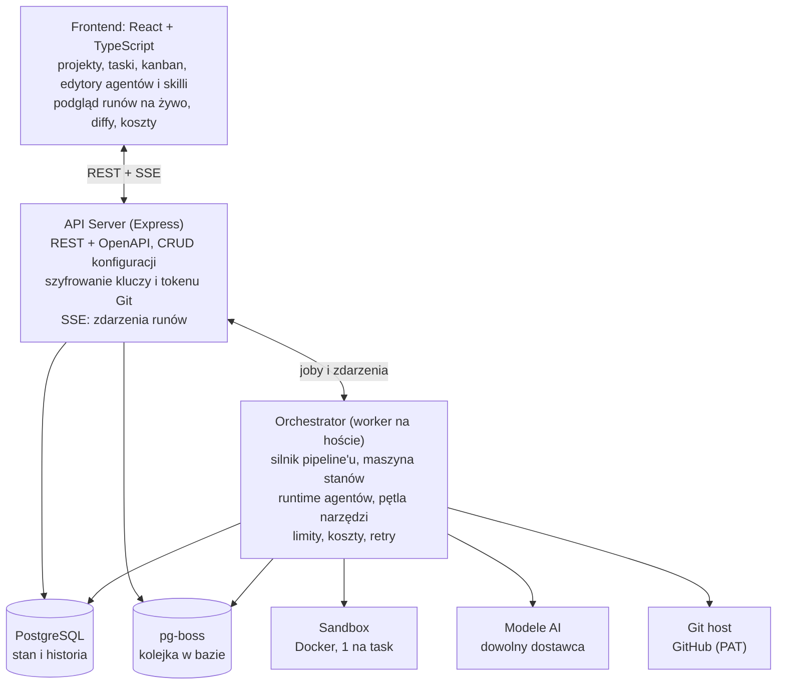
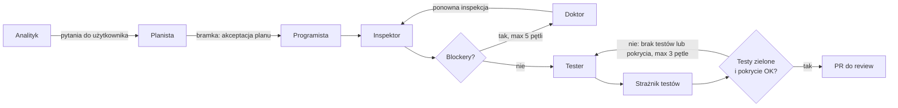
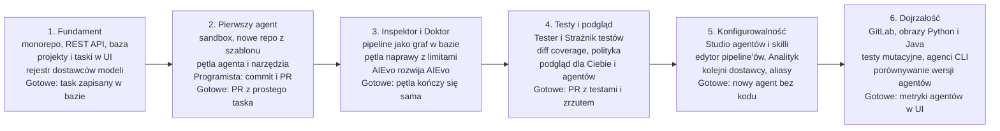

# AIEvo — dokument architektury

Stan na: 2026-09-28. Główne źródło wiedzy o projekcie. Zmiany decyzji wpisuj tutaj (sekcja 18), zanim zmienisz kod.

## Spis treści

1. Cel i zasady projektowe
2. Słownik pojęć
3. Architektura wysokopoziomowa
4. Stack i struktura monorepo
5. Model danych
6. Konfigurowalność
7. Agenci domyślni
8. Pipeline taska
9. Warstwa dostawców modeli (BYOK)
10. Integracja z repozytoriami
11. Sandbox i narzędzia agentów
12. Polityka testów i pokrycia
13. API backendu i komunikacja na żywo
14. Frontend: widoki
15. Bezpieczeństwo, koszty i limity
16. Obserwowalność i audyt
17. Roadmapa
18. Decyzje i ryzyka
19. AIEvo rozwija AIEvo

## 1. Cel i zasady projektowe

AIEvo to webowa platforma self-hosted, w której zespół konfigurowalnych agentów AI realizuje taski w projektach podpiętych pod repozytoria Git, a każda zmiana kodu kończy się pull requestem z testami. Uruchamia się ją na własnym komputerze lub serwerze przez docker-compose; wersja SaaS nie jest planowana.

Użytkownik podpina własne klucze do modeli (Anthropic, OpenAI, Google, Mistral, modele lokalne i dowolny dostawca zgodny z API OpenAI), tworzy projekty, opisuje taski, a agenci je analizują, implementują, sprawdzają, naprawiają i pokrywają testami.

**Zasady, które obowiązują w każdej decyzji:**

1. **Wszystko jest konfiguracją, nie kodem.** Projekty, taski, agenci, skille, konteksty, pipeline'y, limity i polityki testów tworzy się i edytuje w UI. Domyślne ustawienia to tylko szablony, które można skopiować i zmienić.
2. **BYOK (bring your own key).** Platforma nie sprzedaje tokenów. Koszt ponosi użytkownik na swoim koncie u dostawcy.
3. **Człowiek zatwierdza wynik.** Agenci pracują na osobnej gałęzi. Do głównej gałęzi trafia tylko PR zaakceptowany przez człowieka.
4. **Nowy kod = nowe testy.** Task nie może się zakończyć, dopóki zmieniony kod nie jest pokryty testami zgodnie z polityką projektu (sekcja 12).
5. **Każda pętla ma limit.** Iteracje, czas, tokeny i koszt są ograniczone na poziomie taska, projektu i workspace'u.
6. **Izolacja.** Agent wykonuje kod wyłącznie w sandboxie, nigdy na serwerze aplikacji.
7. **Pełna przejrzystość.** Każde wywołanie modelu, narzędzia i każda zmiana pliku są zapisane i widoczne w UI.

**Poza zakresem MVP:** wersja SaaS i multi-tenancy, własny hosting modeli, marketplace skilli, aplikacja mobilna, rozliczenia i płatności.

## 2. Słownik pojęć

| Pojęcie | Znaczenie |
| --- | --- |
| Workspace | Przestrzeń użytkownika lub zespołu. Trzyma klucze do modeli, członków i globalne ustawienia. |
| Projekt | Aplikacja rozwijana na platformie. Jest podpięta do jednego repozytorium i ma własną konfigurację. |
| Task | Jednostka pracy w projekcie (feature, bug, refactor, testy). Każdy task ma własną gałąź i kończy się PR. |
| Agent | Konfiguracja roli AI: prompt systemowy, model, narzędzia, skille, limity i format wyniku. |
| Skill | Wielokrotnego użytku instrukcja w Markdown (np. „jak piszemy testy w Vitest”), dołączana do agentów. |
| Kontekst | Wiedza o projekcie: architektura, konwencje, słownik domeny, wybrane pliki repo. Doklejana do promptów. |
| Pipeline | Konfigurowalny graf kroków, w którym agenci przekazują sobie pracę nad taskiem. |
| Run | Jedno wykonanie pipeline'u dla taska. Task może mieć wiele runów. |
| Step | Jeden krok runu wykonany przez jednego agenta. Zapisuje wejście, wynik, koszt i czas. |
| Sandbox | Izolowany kontener z kopią repo, w którym agent czyta pliki, pisze kod i uruchamia komendy. |
| Provider | Dostawca modeli (Anthropic, OpenAI…) z kluczem użytkownika. |
| Artefakt | Wynik kroku: specyfikacja, plan, diff, raport z testów, raport z inspekcji. |

## 3. Architektura wysokopoziomowa

System składa się z dwóch procesów Node.js: API Server obsługuje UI, a Orchestrator (worker) wykonuje całą pracę agentów w tle. Dzięki temu długie runy nie blokują API, a workery można skalować niezależnie.



Worker też zapisuje stan runów w PostgreSQL. Zdarzenia z workera (nowy krok, log, diff, koszt) trafiają przez PostgreSQL LISTEN/NOTIFY do API, a stamtąd przez SSE (Server-Sent Events) do przeglądarki. Worker działa bezpośrednio na hoście, a w kontenerach są tylko sandboxy.

**Przepływ jednego taska w skrócie:**

1. Użytkownik tworzy task w UI i klika „Uruchom”.
2. API zapisuje run w bazie i wrzuca job do kolejki pg-boss.
3. Worker pobiera job, klonuje repo do nowego sandboxa i tworzy gałąź `agent/<task-id>`.
4. Silnik pipeline'u uruchamia kolejnych agentów. Każdy agent w pętli woła model i narzędzia (odczyt i zapis plików, komendy w sandboxie).
5. Po przejściu wszystkich bramek worker robi commit, push i otwiera PR.
6. Człowiek robi review i merguje albo odsyła task z komentarzem do kolejnego runu.

## 4. Stack i struktura monorepo

Całość to jedno monorepo w TypeScript (pnpm workspaces + Turborepo), z typami i schematami współdzielonymi między frontendem a backendem.

| Warstwa | Wybór | Dlaczego |
| --- | --- | --- |
| Frontend | React + TypeScript, Vite | Szybki dev server, prosty build SPA |
| Routing i dane | TanStack Router, TanStack Query | Typowane trasy, cache i odświeżanie danych z API |
| Stan UI | Zustand | Lekki stan lokalny (np. otwarte panele, filtr kanbanu) |
| UI | Tailwind CSS + shadcn/ui | Gotowe komponenty, pełna kontrola nad wyglądem |
| Edytory | Monaco Editor | Edycja promptów, skilli, konfiguracji i podgląd diffów |
| Graf pipeline'u | React Flow | Wizualny edytor kroków i przejść |
| Formularze | React Hook Form + Zod | Te same schematy Zod walidowane na froncie i backendzie |
| API | Node.js 22, Express 5 | Znany framework, duży ekosystem middleware; zdarzenia runów przez SSE, walidacja Zod jako middleware |
| Kontrakt API | Pełne REST + OpenAPI generowane ze schematów Zod | Dokumentacja API i typowany klient frontendu z jednego źródła (np. zod-to-openapi + openapi-typescript) |
| Baza | PostgreSQL + Drizzle ORM | Relacje + kolumny JSONB na konfiguracje |
| Wyszukiwanie w kontekście | pgvector (od etapu 6) | Wyszukiwanie semantyczne po kodzie i dokumentach |
| Kolejka | pg-boss (kolejka w PostgreSQL) | Joby runów, retry i priorytety bez osobnego Redisa; zdarzenia przez LISTEN/NOTIFY |
| Sandbox | Docker (dockerode) | Izolowany kontener na każdy task |
| Git | git CLI w sandboxie, Octokit, fine-grained token GitHub (PAT) | Klonowanie, commity, PR przez API GitHuba |
| Modele | Vercel AI SDK pod własnym interfejsem LlmClient | Jedna warstwa dla wielu dostawców (sekcja 9) |
| Testy platformy | Vitest, Playwright | Testy jednostkowe i E2E samej aplikacji |
| Auth | Brak logowania na start (jeden lokalny użytkownik) | API nasłuchuje tylko na localhost; opcjonalnie hasło admina przy wystawieniu w sieci |

**Struktura katalogów:**

```
aievo/
├─ apps/
│  ├─ web/            # React SPA
│  ├─ api/            # Express: REST + OpenAPI + SSE
│  └─ worker/         # Orchestrator: pipeline engine + agent runtime (na hoście)
├─ packages/
│  ├─ shared/         # typy, schematy Zod, stałe, eventy
│  ├─ api-client/     # klient REST generowany z OpenAPI
│  ├─ db/             # schemat Drizzle, migracje, seedy
│  ├─ queue/          # pg-boss: joby i zdarzenia (LISTEN/NOTIFY)
│  ├─ llm/            # LlmClient na Vercel AI SDK, rejestr dostawców, capabilities, koszty
│  ├─ agent-runtime/  # pętla agenta, narzędzia, budowa promptu
│  ├─ pipeline/       # silnik maszyny stanów pipeline'u
│  ├─ sandbox/        # zarządzanie kontenerami, exec, pliki
│  ├─ git/            # klon, gałęzie, commity, PR (token PAT)
│  └─ presets/        # agenci, skille, pipeline'y, szablony projektów (templates/)
├─ docker/
│  └─ sandbox-images/ # na start: node (Vitest/Jest)
└─ docker-compose.yml # postgres (api i worker uruchamiane lokalnie)
```

Pakiety powstają wtedy, gdy są potrzebne w danym etapie. Etap 1 potrzebuje tylko `apps/web`, `apps/api`, `packages/shared`, `packages/db`, `packages/llm` i `packages/api-client`.

## 5. Model danych

Konfiguracje (agenci, skille, pipeline'y, polityki) są przechowywane jako wersjonowane rekordy z kolumną JSONB walidowaną schematem Zod. Run zawsze zapisuje, z której wersji konfiguracji korzystał, więc zmiana agenta nie psuje historii.

| Encja | Kluczowe pola | Relacje |
| --- | --- | --- |
| `workspace` | name, settings (JSONB), limits | ma users, providers, projects |
| `user` | email, githubId | należy do workspace'ów przez `membership` (role: owner, member, viewer); na start jeden lokalny użytkownik |
| `provider_credential` | type (anthropic, openai, openai-compatible, google, mistral…), label, encryptedKey, baseUrl | należy do workspace'u |
| `model` | providerId, modelId, displayName, capabilities (JSONB: tools, vision, structuredOutput, promptCaching, reasoning, contextWindow, maxOutput), priceIn, priceOut, enabled | należy do dostawcy; wskazywany przez aliasy i agentów |
| `project` | name, repoUrl, defaultBranch, settings (JSONB), testPolicy (JSONB) | ma tasks, contexts; wskazuje domyślny pipeline |
| `task` | title, description, type, priority, status, acceptanceCriteria, labels, pipelineId, overrides (JSONB) | należy do projektu; ma runs, messages, subtasks (parentId) |
| `agent` | name, role, runtime (native lub cli), systemPrompt, modelRef, params, requiredCapabilities, tools[], skillIds[], contextIds[], outputSchema, limits, version, scope | scope: global, workspace lub projekt |
| `skill` | name, description, content (Markdown), triggers, version, scope | przypinany do agentów |
| `context_item` | type (text, file, glob, url, notatka), content lub path, priority, maxTokens, scope | przypinany do projektu, agenta lub taska |
| `pipeline` | name, graph (JSONB: steps + transitions), version, scope | używany przez taski |
| `run` | taskId, pipelineVersion, status, branch, prUrl, costUsd, tokensIn, tokensOut, startedAt, endedAt | ma steps |
| `step` | runId, stepKey, agentId, agentVersion, iteration, status, input, output (artefakt), costUsd | ma tool_calls, messages |
| `tool_call` | stepId, tool, args, result (skrócony), durationMs, exitCode | — |
| `artifact` | runId, stepId, kind (spec, plan, diff, testReport, inspection, coverage), content | czytane przez kolejne kroki |
| `task_message` | taskId, author (user lub agentId), body, kind (question, answer, comment) | pytania Analityka i odpowiedzi użytkownika |
| `audit_log` | actor, action, entity, diff, at | każda zmiana konfiguracji |

**Zasada wersjonowania:** edycja agenta, skilla lub pipeline'u tworzy nową wersję (`version + 1`). Taski mogą wskazywać „zawsze najnowszą” albo przypiąć konkretną wersję.

**Zasada workspace'u:** każda tabela z danymi użytkownika ma `workspaceId` (bezpośrednio lub przez rodzica), a każde zapytanie go filtruje, mimo że na start jest jeden workspace.

## 6. Konfigurowalność

Każde ustawienie dziedziczy się w kolejności **Platforma → Workspace → Projekt → Task → Run**, a niższy poziom może nadpisać wyższy. UI zawsze pokazuje wartość efektywną i to, skąd pochodzi.

| Obiekt | Co można skonfigurować |
| --- | --- |
| Workspace | dostawcy modeli z rejestru (dowolny obsługiwany typ), modele i ich możliwości, aliasy modeli, domyślny model per rola, budżety miesięczne, członkowie i role |
| Projekt | repo i gałąź bazowa, obraz sandboxa, komendy (install, build, lint, test, coverage, dev), ustawienia podglądu (port, ścieżka sprawdzenia gotowości, czas bezczynności), usługi pomocnicze (np. baza danych), chronione ścieżki, szablon startowy (przy nowym repo), zmienne środowiskowe i sekrety, domyślny pipeline, polityka testów, kontekst projektu, konwencja nazw gałęzi i PR, limity |
| Task | tytuł, opis, kryteria akceptacji, typ, priorytet, etykiety, pipeline, nadpisania agentów i modeli, dodatkowy kontekst, limity, tryb autonomii |
| Agent | nazwa, rola, ikona, prompt systemowy (z szablonowymi zmiennymi), model i parametry (temperature, max tokens, reasoning), narzędzia, skille, kontekst, schemat wyniku, limity iteracji i kosztów, uprawnienia (np. „tylko odczyt”), typ runtime (native albo zewnętrzny agent CLI), wymagane możliwości modelu |
| Skill | treść Markdown, opis kiedy używać, słowa-wyzwalacze, zasięg |
| Kontekst | tekst, pliki lub globy z repo, notatki, URL; priorytet i limit tokenów |
| Pipeline | kroki, przypisani agenci, przejścia i warunki, pętle z limitami, bramki akceptacji człowieka |
| Polityka testów | próg pokrycia zmienionych linii, próg globalny, typy testów, framework, zasady audytu starych testów |

**Tryby autonomii taska:**

- **Manualny**: po każdym kroku agent czeka na akceptację.
- **Z bramkami**: zatrzymanie tylko na bramkach zdefiniowanych w pipelinie (domyślny).
- **Autonomiczny**: bez zatrzymań do PR; nadal obowiązują wszystkie limity.

**Szablony zmiennych w promptach.** Prompt agenta może używać zmiennych, które silnik podstawia przed wysłaniem, np. `{{project.name}}`, `{{task.description}}`, `{{task.acceptanceCriteria}}`, `{{artifacts.spec}}`, `{{artifacts.inspection}}`, `{{project.commands.test}}`.

**Import i eksport.** Agenci, skille i pipeline'y eksportują się do YAML lub Markdown z frontmatterem. Można je też zapisać w repo, w katalogu `.aievo/`, i stamtąd importować. Źródłem prawdy pozostaje baza, więc nie ma konfliktów między UI a plikami.

```yaml
# .aievo/agents/inspector.yaml
name: Inspektor
role: inspector
model: review                  # alias z workspace'u
tools: [read_file, list_files, search_code, run_command]
permissions: { write_files: false }
requiredCapabilities: [tools, vision, structuredOutput]
skills: [code-review-checklist, security-basics]
limits: { maxIterations: 20, maxCostUsd: 0.5 }
outputSchema: inspection-report@1
```

## 7. Agenci domyślni

Platforma startuje z siedmioma presetami agentów. Każdy jest zwykłą konfiguracją: można go edytować, sklonować, wyłączyć albo dodać zupełnie nowego agenta o dowolnej roli.

| Agent | Zadanie | Uprawnienia | Wynik (artefakt) |
| --- | --- | --- | --- |
| Analityk (Pytający Bot) | Zadaje pytania doprecyzowujące, aż task ma jasny zakres i kryteria akceptacji | tylko odczyt repo, pytania do użytkownika | `spec`: cel, zakres, poza zakresem, kryteria akceptacji, założenia |
| Planista | Rozbija spec na kroki, wskazuje pliki do zmiany, ryzyka; opcjonalnie tworzy subtaski | tylko odczyt | `plan`: lista kroków i plików |
| Programista | Implementuje plan i sprawdza na podglądzie, czy aplikacja startuje | odczyt, zapis, komendy (build, lint) | `diff` + notatka o zmianach |
| Inspektor Bot | Uruchamia build, lint, typy i testy; robi code review względem spec i skilli; uruchamia podgląd i sprawdza aplikację w przeglądarce (błędy konsoli, zrzut ekranu względem spec) | tylko odczyt, komendy | `inspection`: lista problemów z wagą (blocker, major, minor), plikiem i linią |
| Doktor Bot | Naprawia problemy z raportu Inspektora, jeden po drugim, i weryfikuje poprawkę na podglądzie | odczyt, zapis, komendy | `diff` + lista naprawionych i nienaprawionych problemów |
| Tester | Pisze testy do nowego i zmienionego kodu, gdy kod jest już poprawny; testy E2E (Playwright) uruchamia na podglądzie | odczyt, zapis tylko w plikach testów, komendy | `testReport`: nowe testy, wyniki, pokrycie zmienionych linii |
| Strażnik testów | Sprawdza, czy istniejące testy są nadal aktualne względem zmienionego kodu | odczyt, zapis tylko w plikach testów, komendy | `testAudit`: testy do usunięcia, poprawy lub pozostawienia, z uzasadnieniem |

**Analityk.** Działa w pętli pytań: zadaje maksymalnie N pytań na rundę (domyślnie 5), czeka na odpowiedzi w zakładce „Pytania” taska i kończy, gdy uzna spec za kompletny albo użytkownik kliknie „Wystarczy, działaj”. Pytania dotyczą zachowania, przypadków brzegowych, UI, danych i kryteriów akceptacji, a nie rzeczy, które da się sprawdzić w repo.

**Inspektor i Doktor.** Inspektor nigdy nie zmienia kodu, a Doktor nigdy sam siebie nie ocenia. To rozdzielenie jest celowe: model sprawdzający własną pracę często uznaje ją za poprawną. Inspektor może, a nawet powinien, używać modelu innego dostawcy niż Programista i Doktor, bo model z innej rodziny łatwiej wyłapuje błędy.

**Tester.** Uruchamia się dopiero, gdy Inspektor zwróci wynik bez blockerów. Czyta diff, spec i kryteria akceptacji, po czym:

1. Wyznacza zmienione i nowe funkcje, komponenty i endpointy.
2. Pisze testy jednostkowe, a dla kryteriów akceptacji testy integracyjne lub E2E (zgodnie z polityką).
3. Uruchamia je i mierzy pokrycie zmienionych linii.
4. Jeśli test nie przechodzi, rozstrzyga: błąd w teście poprawia sam, błąd w kodzie zgłasza do Inspektora i Doktora (Tester nie zmienia kodu produkcyjnego).

**Strażnik testów.** Dla każdego testu dotykającego zmienionego kodu ocenia, czy test:

- **jest aktualny**: sprawdza zachowanie, które nadal obowiązuje → zostaje;
- **jest przestarzały**: sprawdza zachowanie, które spec świadomie zmienił → aktualizacja z uzasadnieniem;
- **jest martwy**: testuje usunięty kod → usunięcie;
- **jest pusty**: przechodzi zawsze, np. bez asercji albo z nadmiernym mockowaniem → poprawa;
- **jest zdublowany**: pokrywa to samo co inny test → scalenie.

Każda zmiana lub usunięcie istniejącego testu jest oznaczona w opisie PR osobną sekcją, bo to miejsce, w którym agent mógłby „naprawić” test zamiast kodu. Strażnik może też działać jako cykliczny task na całym repo (np. raz w tygodniu), niezależnie od zmian.

**Własni agenci.** Przykłady, które użytkownik może dodać bez zmian w kodzie platformy: Recenzent bezpieczeństwa, Agent dokumentacji (README, changelog), Agent UI sprawdzający zrzuty ekranu w przeglądarce, Agent migracji bazy.

## 8. Pipeline taska

Domyślny pipeline „Feature” prowadzi task przez siedmiu agentów i dwie pętle: naprawy (Inspektor ↔ Doktor) i testów (Tester → Strażnik → bramka pokrycia). Pipeline jest grafem zapisanym w bazie, więc kroki, przejścia i limity zmienia się w edytorze.



Po pracy Doktora Inspektor zawsze sprawdza kod ponownie. Po pętli testowej ostatnia inspekcja uruchamia pełny zestaw testów, żeby wyłapać regresje. Gdy dowolna pętla wyczerpie limit, task przechodzi w stan `needs_human` z raportem, co się nie udało.

**Statusy taska:** `draft` → `clarifying` → `ready` → `running` → `needs_human` | `in_review` → `done` | `failed` | `cancelled`.

**Definicja pipeline'u (format zapisu):**

```yaml
name: Feature
steps:
  analyze:   { agent: analyst,   gate: until_spec_complete }
  plan:      { agent: planner,   gate: human_approval }
  implement: { agent: coder }
  inspect:   { agent: inspector }
  fix:       { agent: doctor }
  test:      { agent: tester }
  audit:     { agent: test-guardian }
  verify:    { agent: inspector, mode: full_suite }
transitions:
  - analyze -> plan
  - plan -> implement
  - implement -> inspect
  - inspect -> fix     when: inspection.blockers > 0   maxLoops: 5
  - fix -> inspect
  - inspect -> test    when: inspection.blockers == 0
  - test -> audit
  - audit -> verify
  - verify -> test     when: coverage.changedLines < policy.min   maxLoops: 3
  - verify -> open_pr  when: tests.passed && coverage.ok
```

**Inne presety pipeline'ów:** „Bugfix” (Analityk → test odtwarzający błąd → Doktor → Inspektor), „Tylko testy” (Tester + Strażnik na wskazanym module), „Audyt testów” (sam Strażnik na całym repo), „Refactor” (bez zmian zachowania, istniejące testy muszą przejść bez modyfikacji).

## 9. Warstwa dostawców modeli (BYOK)

Agent nigdy nie woła SDK konkretnego dostawcy. Rozmawia z jednym interfejsem `LlmClient`, zaimplementowanym na Vercel AI SDK, które tłumaczy wiadomości i wywołania narzędzi na format Anthropic, OpenAI lub kolejnego dostawcy. Własny interfejs zostaje, żeby bibliotekę można było wymienić bez zmian w agentach.

```ts
interface LlmClient {
  chat(req: {
    model: string;
    system: string;
    messages: Message[];          // własny, neutralny format
    tools?: ToolDefinition[];     // JSON Schema
    maxTokens?: number;
    temperature?: number;
    signal?: AbortSignal;
  }): AsyncIterable<LlmEvent>;    // text-delta | tool-call | usage | stop
}
```

**Jak to działa:**

- **Klucze.** Użytkownik wkleja klucz w ustawieniach workspace'u. API szyfruje go (AES-256-GCM, klucz główny w zmiennej środowiskowej) i nigdy nie odsyła go do przeglądarki. UI pokazuje tylko końcówkę klucza i przycisk „Testuj połączenie”.
- **Aliasy modeli.** Workspace definiuje aliasy, np. `fast`, `smart`, `review`, wskazujące konkretne modele. Agenci używają aliasów, więc zmiana modelu to jedna zmiana w ustawieniach, nie w każdym agencie.
- **Lista modeli.** Adapter pobiera listę dostępnych modeli z API dostawcy, jeśli to możliwe. Nazw modeli nie wpisuje się na sztywno w kodzie.
- **Cennik.** Ceny za token są konfiguracją w bazie (edytowalną w UI), bo zmieniają się częściej niż kod. Koszt liczony jest z `usage` zwracanego przez dostawcę.
- **Odporność.** Retry z wykładniczym opóźnieniem dla błędów 429 i 5xx, opcjonalny model zapasowy dla aliasu, timeout na wywołanie.
- **Oszczędność tokenów.** Prompt caching tam, gdzie dostawca go wspiera (stały prompt systemowy, skille i kontekst projektu na początku wiadomości).
- **Kolejni dostawcy.** Każdy endpoint zgodny z API OpenAI (np. lokalne modele przez Ollama) można dodać przez pole `baseUrl` bez pisania nowego adaptera.

**Rejestr dostawców.** Dostawcę dodaje się w UI, wybierając typ z listy, a nie przez zmianę kodu. Nowy typ to mały adapter i jeden wpis w rejestrze.

| Typ dostawcy | Przykłady | Od etapu |
| --- | --- | --- |
| `anthropic` | modele Claude | 1 |
| `openai` | modele GPT | 1 |
| `openai-compatible` | Ollama, LM Studio, OpenRouter, vLLM, inne API zgodne z OpenAI | 1 |
| `google`, `mistral`, `xai`, `deepseek`, `bedrock`, `azure` i kolejne | adaptery dostępne w Vercel AI SDK | 5 |

**Możliwości modelu (capabilities).** Każdy model ma zapisane, co potrafi: wywoływanie narzędzi, obrazy, wymuszony format odpowiedzi, cache promptu, tryb rozumowania, długość kontekstu i maksymalną długość odpowiedzi. Wartości są uzupełniane automatycznie tam, gdzie da się je pobrać od dostawcy, i edytowalne w UI (np. dla modeli lokalnych). Każdy agent deklaruje wymagania:

```yaml
# Inspektor
requiredCapabilities: [tools, vision, structuredOutput]
```

Platforma sprawdza zgodność przy zapisie agenta i przed startem każdego runu (alias mógł w międzyczasie wskazać inny model). Model, który nie spełnia wymagań, nie zostanie przypisany, zamiast wyłożyć się w połowie runu. Bez obsługi obrazów agent nie dostaje narzędzia `browser_check` ze zrzutami ekranu.

**Mieszanie dostawców.** Każda rola może używać innego dostawcy. Domyślnie zalecane: Inspektor z innej rodziny modeli niż Programista i Doktor. Modele lokalne sprawdzą się raczej w prostszych rolach (np. Analityk), bo w długich pętlach agentowych zwykle radzą sobie słabiej niż czołowe modele komercyjne.

**Typy agentów (AgentRuntime).** Silnik pipeline'u nie wie, jak agent wykonuje pracę. Rozmawia z interfejsem, który ma dwie implementacje:

```ts
interface AgentRuntime {
  run(input: {
    agent: AgentConfig;
    task: TaskContext;          // spec, plan, artefakty, kontekst
    sandbox: SandboxHandle;
    limits: Limits;
    signal: AbortSignal;
  }): AsyncIterable<AgentEvent>; // zdarzenia + końcowy artefakt
}
```

- **`native` (domyślny, od etapu 2):** własna pętla z narzędziami, pełna kontrola uprawnień, każde wywołanie narzędzia widoczne w UI, dokładny koszt.
- **`cli` (opcja, etap 6):** uruchamia w sandboxie zewnętrznego agenta programistycznego, np. Claude Code, Codex CLI, Gemini CLI lub Aider. Konfiguracja: komenda, sposób przekazania promptu (argument, plik, stdin), zmienne środowiskowe, timeout. Po zakończeniu AIEvo zbiera diff i log jako artefakt.

Agent typu `cli` może np. zastąpić Programistę, a Inspektor, Doktor, Tester i Strażnik nadal działają normalnie, więc kontrola jakości zostaje. Ograniczenia: uprawnienia są sprawdzane dopiero na diffie (np. zmiana istniejącego testu przez Programistę CLI to blocker Inspektora), w UI widać log zamiast pojedynczych wywołań narzędzi, a koszt bywa tylko szacunkowy. Klucz API musi trafić do sandboxa jako zmienna środowiskowa, co jest świadomym wyjątkiem od zasady z sekcji 15, dlatego ten typ włącza się osobno w projekcie.

## 10. Integracja z repozytoriami

Na start obsługiwany jest wyłącznie GitHub przez jeden fine-grained Personal Access Token. Projekt można podłączyć do istniejącego repozytorium albo utworzyć nowe repozytorium prosto z AIEvo. GitHub App, webhooki i GitLab dochodzą później za tym samym interfejsem `GitProvider`.

**Token GitHub.** Ma dostęp do wszystkich repozytoriów, bo repo, które dopiero powstanie, nie może być wcześniej wybrane w ustawieniach tokena. Uprawnienia: Administration, Contents i Pull requests do zapisu, Metadata do odczytu, z datą wygaśnięcia. Token jest szyfrowany jak klucze do modeli i zna go tylko adapter Git w workerze. Adapter ma listę dozwolonych operacji: lista repo, utworzenie repo, klonowanie, pierwszy commit nowego repo, push na gałęzie agentów, tworzenie PR, odczyt komentarzy. Usuwania repo i zmiany ustawień istniejących repo w adapterze po prostu nie ma.

**Ścieżka A: podłącz istniejące repo**

1. W kreatorze projektu wybierasz repo z listy i gałąź bazową.
2. Platforma klonuje repo do tymczasowego sandboxa i wykrywa stack: menedżer pakietów, framework testowy (Vitest lub Jest), skrypty z `package.json`, istniejące pliki kontekstu (`README`, `CLAUDE.md`, `AGENTS.md`, `.aievo/`).
3. Kreator proponuje komendy install, build, lint, test, coverage i dev. Zatwierdzasz je lub poprawiasz.
4. Opcjonalnie agent „Onboarding” generuje szkic kontekstu projektu (architektura, konwencje) do przejrzenia.

**Ścieżka B: utwórz nowe repo**

1. W kreatorze podajesz nazwę, opis, właściciela (Twoje konto lub organizacja), widoczność (domyślnie prywatne) i szablon startowy.
2. AIEvo tworzy repo przez API GitHuba. Utworzenie repo zawsze wymaga Twojego kliknięcia; agenci nie mają takiego narzędzia.
3. Worker kopiuje szablon do sandboxa, podstawia nazwę projektu, robi pierwszy commit na `main` i push. To jedyny zapis na gałąź bazową i wykonuje go platforma, nie agent.
4. Komendy projektu, port podglądu, usługi pomocnicze i polityka testów są ustawiane z manifestu szablonu, bez wykrywania.
5. Projekt jest gotowy na pierwszy task.

**Szablony startowe.** Leżą w `packages/presets/templates/<nazwa>/` jako zwykłe pliki projektu oraz manifest `template.yaml`. Na start są dwa: „React + Vite + TypeScript + Vitest” (domyślny) i „Pusty projekt” (tylko README i `.gitignore`, strukturę tworzy agent z pierwszego taska). Własne szablony, np. „Express API + PostgreSQL”, dodaje się bez zmian w kodzie. Szablony z repozytoriów-szablonów na GitHubie mogą dojść później.

```yaml
# packages/presets/templates/react-vite-ts/template.yaml
name: React + Vite + TypeScript + Vitest
description: SPA w React z testami i pokryciem
commands:
  install: npm install
  dev: npm run dev -- --host 0.0.0.0 --port 5173
  build: npm run build
  lint: npm run lint
  test: npm test
  coverage: npm run test:coverage
preview: { port: 5173, readyPath: / }
services: []                 # np. postgres dla szablonu z backendem
testPolicy: { framework: vitest, changedLines: { minLineCoverage: 80 } }
context: [docs/CONVENTIONS.md]
```

**Praca na tasku:**

- Każdy run pracuje na gałęzi według wzorca z konfiguracji, domyślnie `agent/<task-id>-<slug>`.
- Commity są robione po każdym kroku zmieniającym pliki, z opisem kroku. Dzięki temu historię runu można przejrzeć commit po commicie i cofnąć wybrany krok.
- Na końcu worker otwiera PR z opisem generowanym z artefaktów: spec, podsumowanie zmian, raport testów i pokrycia, sekcja „Zmienione i usunięte testy”, koszt runu.
- Poprawki po review uruchamia się z UI jako kolejny run; worker pobiera przy starcie komentarze z PR przez API GitHuba. Uruchamianie komentarzem `/aievo fix` wymaga webhooków, więc jest w etapie 6.
- Agenci nigdy nie robią push na gałąź bazową ani force-push na cudze gałęzie. Wymusza to adapter Git, nie prompt.

## 11. Sandbox i narzędzia agentów

Każdy run dostaje własny kontener Docker z kopią repo, a agenci działają w nim wyłącznie przez zestaw narzędzi o jasno określonych uprawnieniach. Worker działa na hoście i steruje kontenerami przez Docker socket.

**Kontener:**

- Na start jeden obraz bazowy dla projektów Node.js/TypeScript z Vitest lub Jest. Obrazy dla Pythona i Javy oraz własny Dockerfile z repo dochodzą w etapie 6.
- Limity: CPU, pamięć, czas życia, rozmiar dysku. Kontener działa jako użytkownik bez uprawnień roota.
- Sieć domyślnie ograniczona do rejestrów pakietów (npm, PyPI, Maven). Dodatkowe domeny ustawia się w projekcie.
- Kontener żyje przez cały run, więc `node_modules` i cache buildu nie są instalowane od nowa w każdym kroku. Po zakończeniu runu jest usuwany.
- Sekrety projektu trafiają do kontenera jako zmienne środowiskowe tylko wtedy, gdy projekt na to pozwala, i nigdy do promptu modelu.

**Narzędzia (tool calling):**

| Narzędzie | Co robi | Kto domyślnie ma dostęp |
| --- | --- | --- |
| `list_files` | Drzewo katalogów z filtrem glob | wszyscy |
| `read_file` | Odczyt pliku lub zakresu linii | wszyscy |
| `search_code` | Wyszukiwanie tekstu lub regex (ripgrep) | wszyscy |
| `write_file` | Zapis całego pliku | Programista, Doktor; Tester i Strażnik tylko w ścieżkach testów |
| `edit_file` | Podmiana fragmentu pliku (find → replace) | jak `write_file` |
| `run_command` | Komenda z listy dozwolonych, z timeoutem | wszyscy poza Analitykiem i Planistą |
| `run_tests` | Uruchamia testy i zwraca ustrukturyzowany wynik oraz pokrycie | Inspektor, Doktor, Tester, Strażnik |
| `git_diff` | Diff względem gałęzi bazowej | wszyscy |
| `ask_user` | Pytanie do użytkownika, run czeka na odpowiedź | Analityk (opcjonalnie inni) |
| `read_artifact` | Odczyt artefaktów wcześniejszych kroków | wszyscy |
| `browser_check` | Otwiera podgląd w headless Chromium (Playwright), wykonuje opcjonalne kroki (kliknij, wpisz, poczekaj na tekst), zwraca zrzut ekranu, błędy konsoli i nieudane żądania sieciowe | Programista, Inspektor, Doktor, Tester (od etapu 4) |
| `preview_start` | Uruchamia komendę dev w tle w sandboxie runu i czeka, aż aplikacja odpowie; zwraca adres i status | Programista, Inspektor, Doktor, Tester |
| `preview_logs` | Ostatnie linie stdout i stderr serwera podglądu | jak `preview_start` |
| `preview_stop` | Zatrzymuje serwer podglądu (np. przed restartem po zmianie konfiguracji) | jak `preview_start` |
| `http_request` | Wywołanie endpointu uruchomionej aplikacji (metoda, ścieżka, body) i zwrot odpowiedzi | jak `preview_start` |

**Uprawnienia są sprawdzane w kodzie narzędzia, nie w prompcie.** Jeśli Tester spróbuje zapisać plik poza `**/*.test.*` lub katalogiem testów z polityki, narzędzie zwróci błąd. Wyniki komend są przycinane (np. ostatnie 200 linii) przed wysłaniem do modelu, żeby nie przepalać tokenów.

**Pętla agenta** (`packages/agent-runtime`): zbuduj prompt (system + skille + kontekst + artefakty + task) → wywołaj model → wykonaj wywołania narzędzi → dopisz wyniki → powtarzaj, aż model zwróci wynik zgodny ze schematem albo wyczerpie się limit iteracji lub kosztu. Wynik jest walidowany schematem Zod; niepoprawny wynik to jedna próba poprawy, potem błąd kroku.

**Podgląd aplikacji.** Każdy projekt ma komendę `dev` i port podglądu, dzięki czemu aplikację można uruchomić z UI albo przez agenta. Są dwa rodzaje podglądu:

| Rodzaj | Gdzie działa | Kod | Dostęp | Koniec |
| --- | --- | --- | --- | --- |
| Podgląd dla Ciebie (przycisk „Podgląd”) | Osobny kontener z kodem z gałęzi taska | Ostatni commit na gałęzi | Link w UI, port z puli 4100–4199 na 127.0.0.1 | Po 30 min bezczynności, po merge lub odrzuceniu PR, albo ręcznie |
| Podgląd dla agentów (`preview_start`) | Proces w tle w sandboxie runu | Bieżące pliki, także niezacommitowane | Tylko z wnętrza sandboxa (Playwright w tym samym kontenerze) | Z końcem runu albo przez `preview_stop` |

**Jak działa start podglądu:**

1. Platforma uruchamia komendę `dev` projektu, np. `npm run dev -- --host 0.0.0.0 --port 5173`.
2. Co sekundę odpytuje ścieżkę gotowości (domyślnie `/`), aż dostanie odpowiedź 200. Limit czasu: 90 s.
3. Gdy aplikacja nie wstanie, wynik zawiera ostatnie linie logów, żeby agent mógł zdiagnozować problem.

**Jak agenci z niego korzystają:**

- **Programista** po implementacji uruchamia podgląd i sprawdza, czy strona się ładuje bez błędów.
- **Inspektor** dla projektów z frontendem traktuje jako blocker: aplikacja nie startuje, błędy w konsoli, nieudane żądania sieciowe. Porównuje zrzut ekranu z kryteriami akceptacji (model z obsługą obrazów).
- **Doktor** odtwarza błąd na podglądzie przed poprawką i potwierdza, że po poprawce zniknął.
- **Tester** pisze testy E2E w Playwright i uruchamia je na podglądzie; do API używa `http_request`.

Zrzuty ekranu z `browser_check` zapisują się jako artefakty kroku, więc w podglądzie runu widać dokładnie to, co widział agent.

**Usługi pomocnicze.** Aplikacje z bazą danych albo cache potrzebują ich do testów i podglądu. Projekt (lub szablon) deklaruje je w konfiguracji, a worker uruchamia je obok sandboxa w osobnej sieci Docker dla danego runu:

```yaml
services:
  - name: db
    image: postgres:16
    env: { POSTGRES_PASSWORD: test, POSTGRES_DB: app }
    healthcheck: pg_isready -U postgres
    expose: { DATABASE_URL: postgres://postgres:test@db:5432/app }
commands:
  setup: npm run db:migrate && npm run db:seed   # po starcie usług
```

Zmienne z `expose` trafiają do sandboxa jako zmienne środowiskowe. Usługi są tymczasowe: powstają ze startem runu lub podglądu i znikają razem z nim, więc każdy run ma czystą bazę. Podgląd dla Ciebie dostaje własny, osobny zestaw usług.

## 12. Polityka testów i pokrycia

Zasada: każda nowa lub zmieniona linia kodu produkcyjnego musi być pokryta testami, zanim task trafi do PR. Pokrycie liczone jest na **zmienionych liniach** (diff coverage), a nie tylko globalnie, bo stary, niepokryty kod nie powinien blokować nowych tasków.

**Polityka projektu (konfigurowalna):**

```yaml
testPolicy:
  framework: vitest            # wykrywany automatycznie, można nadpisać
  commands:
    test: pnpm test
    coverage: pnpm test --coverage --reporter=json
  coverageFormat: istanbul-json  # lub lcov, cobertura
  changedLines:
    minLineCoverage: 80          # % zmienionych linii
    minBranchCoverage: null      # na start bez progu gałęzi
  global:
    failIfDropsBy: 1             # globalne pokrycie nie może spaść o więcej niż 1 pp
  requiredTypes:
    unit: always
    integration: on_api_change   # przy zmianie endpointów
    e2e: on_acceptance_criteria  # dla kryteriów akceptacji z UI
  testPaths: ["**/*.test.ts", "**/*.spec.ts", "tests/**"]
  exclude: ["**/*.d.ts", "src/generated/**"]
  audit:
    onEveryRun: true             # Strażnik po każdym tasku
    scheduled: weekly            # pełny audyt całego repo
    allowDeleteTests: require_human  # usunięcie testu wymaga akceptacji
```

**Jak liczone jest pokrycie zmienionych linii:** worker bierze `git diff` względem gałęzi bazowej, wybiera dodane i zmienione linie w plikach produkcyjnych, a następnie sprawdza je w raporcie pokrycia z frameworka testowego. Wynik trafia do artefaktu `coverage` i opisu PR.

**Zabezpieczenia przed „oszukiwaniem” testów:**

- Tester i Strażnik nie mogą zmieniać kodu produkcyjnego, a Programista i Doktor domyślnie nie mogą zmieniać istniejących testów (tylko dodawać nowe). Egzekwuje to narzędzie zapisu.
- Inspektor sprawdza nowe testy pod kątem pustych asercji, `skip`, `only` i nadmiernego mockowania.
- Opcjonalnie (etap 6): testy mutacyjne na zmienionych plikach (Stryker), które pokazują, czy testy faktycznie wykrywają zmiany w kodzie.
- Każda modyfikacja lub usunięcie istniejącego testu jest wypisana w PR z uzasadnieniem Strażnika.

## 13. API backendu i komunikacja na żywo

API to CRUD na konfiguracjach plus kilka akcji sterujących runem; wszystko, co dzieje się w trakcie runu, płynie do UI przez SSE. API jest w pełni REST-owe, opisane specyfikacją OpenAPI generowaną ze schematów Zod, a frontend korzysta z wygenerowanego, typowanego klienta.

| Metoda i ścieżka | Opis |
| --- | --- |
| `GET/POST /workspaces/:id/providers` | Lista i dodawanie kluczy do modeli |
| `POST /providers/:id/test` | Test połączenia i pobranie listy modeli |
| `GET/POST /projects`, `PATCH /projects/:id` | Projekty i ich ustawienia; POST przyjmuje tryb repo: istniejące albo nowe z szablonu |
| `POST /projects/:id/detect` | Wykrycie stacku i komend w repo |
| `GET/POST /projects/:id/tasks`, `PATCH /tasks/:id` | Taski, zmiana statusu i kolejności na tablicy |
| `POST /tasks/:id/runs` | Start runu (opcjonalnie z nadpisaniami) |
| `POST /runs/:id/cancel` | Przerwanie runu |
| `POST /runs/:id/approve`, `/reject` | Decyzja na bramce (z komentarzem) |
| `POST /tasks/:id/messages` | Odpowiedź na pytania Analityka |
| `GET/POST/PATCH /agents`, `/skills`, `/contexts`, `/pipelines` | Edycja konfiguracji, zawsze tworzy nową wersję |
| `GET /agents/:id/versions` | Historia wersji i przywracanie |
| `POST /agents/:id/playground` | Test agenta na przykładowym wejściu bez tworzenia taska |
| `GET /runs/:id`, `/runs/:id/steps` | Szczegóły runu, artefakty, koszty |
| `POST /webhooks/github` | Zdarzenia z GitHuba (etap 6, wymaga publicznego adresu lub tunelu) |
| `POST /tasks/:id/preview` | Uruchomienie podglądu gałęzi taska; zwraca adres na localhost |
| `GET /previews/:id`, `/previews/:id/logs` | Status i logi podglądu |
| `DELETE /previews/:id` | Zatrzymanie podglądu |
| `GET /templates` | Lista szablonów startowych z manifestami |
| `GET /github/owners` | Twoje konto i organizacje, w których możesz utworzyć repo |
| `GET /provider-types` | Rejestr obsługiwanych typów dostawców i wymaganych pól |
| `GET /models`, `PATCH /models/:id` | Modele wszystkich dostawców, ich możliwości i ceny; edycja capabilities i cennika |

**Zdarzenia na żywo (SSE):** `GET /runs/:id/events` i `GET /projects/:id/events` to strumienie Server-Sent Events, obsługiwane w przeglądarce przez `EventSource` z automatycznym ponownym łączeniem. Typy zdarzeń: `run.status`, `step.started`, `step.token` (strumień tekstu modelu), `step.tool_call`, `step.tool_result`, `step.finished`, `artifact.created`, `question.asked`, `cost.updated`, `task.updated`, `preview.status`. Są zdefiniowane w `packages/shared`, więc frontend i worker używają tego samego kontraktu. Wszystkie akcje (start, zatwierdź, przerwij, podgląd) idą zwykłymi żądaniami REST.

## 14. Frontend: widoki

Aplikacja ma trzy główne obszary: projekty z taskami, podgląd runów na żywo oraz „Studio” do konfiguracji agentów, skilli, kontekstów i pipeline'ów.

| Widok | Co zawiera |
| --- | --- |
| Dashboard | Lista projektów, aktywne runy, taski czekające na człowieka, koszt w tym miesiącu |
| Kreator projektu | Podłączenie istniejącego repo albo utworzenie nowego (nazwa, właściciel, widoczność, szablon), komendy wykryte lub z szablonu, usługi pomocnicze, polityka testów, kontekst startowy |
| Tablica tasków | Kanban według statusu, filtry, szybkie tworzenie taska, przeciąganie |
| Szczegóły taska | Opis i kryteria, zakładka Pytania (rozmowa z Analitykiem), lista runów, link do PR, przycisk Podgląd z linkiem do działającej aplikacji |
| Podgląd runu | Oś czasu kroków, strumień myślenia i wywołań narzędzi, diff z Monaco, raport Inspektora, raport testów i pokrycia, koszt na krok, zrzuty ekranu z browser_check, przyciski Podgląd / Zatwierdź / Odrzuć / Przerwij |
| Studio: Agenci | Lista i edytor agenta: prompt z podglądem zmiennych, model, narzędzia, skille, limity, historia wersji, playground |
| Studio: Skille | Edytor Markdown z podglądem, informacja którzy agenci używają skilla |
| Studio: Konteksty | Notatki, pliki z repo, szacowana liczba tokenów |
| Studio: Pipeline'y | Edytor grafu w React Flow, walidacja (np. pętla bez limitu), symulacja przejść |
| Ustawienia | Dostawcy modeli z rejestru, modele i ich możliwości, aliasy, cennik, budżety, członkowie, import i eksport konfiguracji |

**Uwagi do implementacji:**

- Formularze konfiguracji generowane z tych samych schematów Zod co walidacja API, żeby nowe pole konfiguracji wymagało zmiany w jednym miejscu.
- Podgląd runu subskrybuje strumień SSE (EventSource) i dopisuje zdarzenia do cache TanStack Query, bez odpytywania API.
- Każdy edytor konfiguracji ma przycisk „Testuj” (playground), żeby sprawdzić agenta lub skill przed użyciem na prawdziwym tasku.

## 15. Bezpieczeństwo, koszty i limity

Największe ryzyka to wyciek kluczy, niekontrolowany koszt pętli agentów i wykonanie złośliwego kodu, więc każde z nich ma zabezpieczenie w kodzie, a nie tylko w prompcie.

**Bezpieczeństwo:**

- Klucze API i tokeny Git szyfrowane w bazie, odszyfrowywane tylko na czas pojedynczego wywołania: w workerze podczas runu, a klucze do modeli także w API przy teście połączenia (`POST /providers/:id/test`). Odszyfrowany klucz nie trafia do odpowiedzi ani logów. Token GitHub ma dostęp do wszystkich repozytoriów, dlatego adapter Git udostępnia tylko listę dozwolonych operacji (sekcja 10), a token ma datę wygaśnięcia.
- Kod z repo wykonywany wyłącznie w sandboxie; worker nie uruchamia niczego z repo na hoście.
- Ochrona przed prompt injection: treść plików, wyniki komend i komentarze z PR są oznaczone w prompcie jako dane, a narzędzia i tak nie pozwalają na akcje spoza uprawnień agenta.
- Lista dozwolonych komend w projekcie; komendy spoza listy wymagają akceptacji człowieka. Chronione ścieżki projektu (np. kod uprawnień, limitów, sandboxa, autoryzacji) oznaczają PR ostrzeżeniem i wymagają osobnego zatwierdzenia.
- API, frontend i podglądy nasłuchują domyślnie tylko na localhost (127.0.0.1); wystawienie w sieci lokalnej wymaga ustawienia hasła admina.

**Limity (każdy konfigurowalny na każdym poziomie z sekcji 6):**

| Limit | Domyślnie | Co się dzieje po przekroczeniu |
| --- | --- | --- |
| Iteracje na krok agenta | 30 | Krok kończy się błędem, task → `needs_human` |
| Pętle Inspektor ↔ Doktor | 5 | Task → `needs_human` z listą nienaprawionych problemów |
| Pętle testów | 3 | Task → `needs_human` z raportem pokrycia |
| Koszt na run | 5 USD | Run wstrzymany, użytkownik może podnieść limit i wznowić |
| Budżet miesięczny workspace'u | brak (ustawia użytkownik) | Nowe runy blokowane |
| Czas runu | 60 min | Run przerwany, zmiany zostają na gałęzi |
| Równoległe runy na projekt | 2 | Kolejne czekają w kolejce |
| Podgląd agenta | 1 na run, start do 90 s | Narzędzie zwraca błąd z ostatnimi liniami logów |
| Podglądy dla Ciebie | 3 naraz, zamknięcie po 30 min bezczynności | Najstarszy podgląd jest zamykany |

Wartości domyślne są punktem startowym do kalibracji na prawdziwych taskach.

**Wykrywanie zapętlenia:** jeśli Doktor dwa razy z rzędu zwróci identyczny diff albo Inspektor ten sam zestaw problemów, pętla kończy się wcześniej, bez czekania na limit.

## 16. Obserwowalność i audyt

Każdy run da się odtworzyć krok po kroku: jaki prompt poszedł do modelu, co model odpowiedział, jakie narzędzia wywołał i ile to kosztowało.

- **Trace runu:** pełne wiadomości do i od modelu zapisywane per krok (z możliwością wyłączenia i czasem przechowywania ustawianym w workspace).
- **Metryki na agenta:** średnia liczba iteracji, koszt, odsetek kroków zakończonych sukcesem, ile razy Inspektor odrzucił pracę. Pozwala porównać wersje agenta i modele.
- **Metryki projektu:** czas od taska do PR, odsetek PR zmergowanych bez poprawek, pokrycie zmienionych linii w czasie.
- **Logi techniczne:** pino (JSON) w API i workerze, identyfikator runu w każdym logu. Opcjonalnie OpenTelemetry.
- **Audyt:** każda zmiana konfiguracji (kto, kiedy, diff) w `audit_log`.
- **Porównywanie wersji agentów (etap 6):** ten sam zestaw tasków testowych uruchamiany na dwóch wersjach agenta, z porównaniem wyników i kosztów.

## 17. Roadmapa

Budowa idzie w sześciu etapach. Najważniejszy kamień milowy to etap 2: jeden agent, który na prawdziwym repo robi zmianę i otwiera PR. Wszystko potem to rozbudowa tej ścieżki.



**Etap 1: Fundament**

- [ ] Monorepo (pnpm, Turborepo), `docker-compose` z PostgreSQL
- [ ] Schemat bazy w Drizzle: workspace, user, project, task, provider_credential, model
- [ ] Express API (REST + OpenAPI ze schematów Zod), bez logowania, nasłuch na localhost
- [ ] React: lista projektów, kanban tasków, formularz taska
- [ ] Rejestr dostawców: Anthropic, OpenAI i „zgodny z OpenAI” (Ollama, OpenRouter); modele z capabilities; zaszyfrowane klucze i test połączenia

**Etap 2: Pierwszy agent**

- [ ] Token GitHub (PAT), kreator projektu: podłączenie istniejącego repo albo utworzenie nowego z szablonu („React + Vite + TS + Vitest”, „Pusty projekt”)
- [ ] Worker z pg-boss, sandbox Docker, klonowanie repo i gałąź taska
- [ ] `LlmClient` na Vercel AI SDK
- [ ] Interfejs AgentRuntime i implementacja native: pętla agenta z narzędziami list_files, read_file, search_code, edit_file, run_command
- [ ] Agent Programista (prompt w pliku), commit, push, PR
- [ ] Zapis stepów i tool_calli, prosta lista kroków w UI

**Etap 3: Inspektor i Doktor**

- [ ] Silnik pipeline'u (graf z YAML w bazie, warunki, limity pętli)
- [ ] Agenci Inspektor i Doktor z ustrukturyzowanym raportem
- [ ] SSE i podgląd runu na żywo, diff w Monaco
- [ ] Limity kosztów i czasu, status `needs_human`
- [ ] Chronione ścieżki w projekcie i ostrzeżenie w PR
- [ ] Projekt AIEvo w AIEvo: tagowane wersje, skrypty aktualizacji i rollbacku z backupem bazy (sekcja 19)

**Etap 4: Testy i podgląd**

- [ ] Polityka testów w projekcie, wykrywanie frameworka
- [ ] Pokrycie zmienionych linii z raportu frameworka
- [ ] Agent Tester, bramka pokrycia
- [ ] Agent Strażnik testów, sekcja zmienionych testów w PR
- [ ] Uprawnienia zapisu tylko w plikach testów
- [ ] Komenda `dev` i ustawienia podglądu w projekcie
- [ ] Przycisk „Podgląd”: kontener z gałęzi taska, port z puli, automatyczne zamykanie
- [ ] Narzędzia agentów: `preview_start`, `preview_logs`, `preview_stop`, `http_request`, `browser_check` (Playwright w obrazie sandboxa)
- [ ] Inspektor: brak startu aplikacji i błędy konsoli jako blockery; usługi pomocnicze (np. PostgreSQL) dla sandboxa runu i podglądu

**Etap 5: Pełna konfigurowalność**

- [ ] Studio: agenci, skille, konteksty z wersjonowaniem i playgroundem
- [ ] Edytor pipeline'ów w React Flow
- [ ] Agent Analityk i zakładka Pytania
- [ ] Kolejne adaptery dostawców (Google, Mistral i inne z Vercel AI SDK), aliasy modeli, cennik w bazie, walidacja wymagań agenta względem możliwości modelu
- [ ] Import i eksport, katalog `.aievo/` w repo

**Etap 6: Dojrzałość**

- [ ] GitLab, pgvector dla kontekstu, obrazy sandboxa dla Pythona i Javy
- [ ] Testy mutacyjne, cykliczny audyt testów
- [ ] Metryki agentów i porównywanie wersji; agenci typu CLI (np. Claude Code, Codex CLI, Gemini CLI, Aider) jako AgentRuntime
- [ ] Uruchamianie runów komentarzem w PR (webhooki przez tunel lub GitHub App)

**Dobra praktyka od pierwszego dnia:** pierwsze taski dla agentów daj na repo samej platformy. Błędy agentów wyjdą szybko, a Ty będziesz ich pierwszym użytkownikiem.

## 18. Decyzje i ryzyka

Decyzje startowe są podjęte; zmiana którejkolwiek z nich wymaga aktualizacji sekcji wskazanych w tabeli.

**Podjęte decyzje:**

| Obszar | Wybór | Dlaczego | Sekcje |
| --- | --- | --- | --- |
| Model wdrożenia | Self-hosted, bez SaaS | Mniejszy zakres, kod i klucze zostają u Ciebie | 1 |
| Użytkownicy | Jeden, bez logowania; `workspaceId` w tabelach | Krótszy etap 1, furtka na mały zespół | 4, 5, 15 |
| Backend | Express 5 | Znany stack, duży ekosystem | 3, 4 |
| Kontrakt API | Pełne REST + OpenAPI ze schematów Zod | Standard, łatwy do użycia przez inne klienty (np. CLI) | 4, 13 |
| Zdarzenia na żywo | SSE | Ruch tylko serwer → przeglądarka, prostsze niż WebSocket | 3, 13, 14 |
| Kolejka | pg-boss + LISTEN/NOTIFY | Jedna baza zamiast PostgreSQL i Redisa | 3, 4 |
| GitHub | Fine-grained PAT z dostępem do wszystkich repo i listą dozwolonych operacji; webhooki w etapie 6 | Działa bez publicznego adresu | 10 |
| Pętla agenta | Własna (AgentRuntime native), na Vercel AI SDK; zewnętrzni agenci CLI jako opcja w etapie 6 | Kontrola nad narzędziami i uprawnieniami, wielu dostawców | 9, 11 |
| Obsługiwane repo | Node.js/TypeScript z Vitest lub Jest | Jeden obraz sandboxa, jeden format pokrycia | 10, 11, 12 |
| Źródło prawdy konfiguracji | Baza; `.aievo/` jako eksport i import | Brak konfliktów UI ↔ pliki | 6 |
| Tester i Strażnik | Dwóch osobnych agentów | Strażnik działa też samodzielnie (audyt repo) | 7 |
| Modele per rola | Najmocniejszy: Programista, Doktor, Inspektor; tańszy: Analityk, Planista, Tester | Słaby Inspektor przepuszcza błędy | 9 |
| Próg pokrycia | 80% zmienionych linii, bez progu gałęzi | Realistyczny start, podnoszony z czasem | 12 |
| Autonomia | Bramka akceptacji planu | Najtańszy moment na korektę kierunku | 6, 8 |
| Worker | Na hoście; sandboxy w kontenerach | Prostsze debugowanie | 3, 11 |
| Podgląd aplikacji | Przycisk „Podgląd” dla Ciebie + narzędzia podglądu i browser_check dla agentów, od etapu 4 | Ocena frontendu przed merge; agent sprawdza swoją pracę w przeglądarce | 6, 7, 11, 13, 14, 15, 17 |
| Tworzenie repo | Z kreatora AIEvo, zawsze po Twoim kliknięciu, od etapu 2 | Nowy projekt bez wychodzenia z aplikacji; małe repo jako poligon dla agentów | 10, 13, 14, 17 |
| Start nowego repo | Szablon z AIEvo (domyślnie React + Vite + TS + Vitest) albo pusty projekt | Działające dev, testy i podgląd od pierwszego taska | 4, 10 |
| AIEvo rozwija AIEvo | Od końca etapu 3: tagowane wersje, chronione ścieżki, backup przed aktualizacją | Samorozwój bez ryzyka utraty działającego narzędzia | 15, 17, 19 |
| Odszyfrowanie kluczy do modeli | W workerze na czas runu oraz w API na czas testu połączenia; klucz nigdy nie wraca w odpowiedzi | Test połączenia działa bez workera (etap 1) i od razu pokazuje błędny klucz | 9, 13, 15 |
| Dostawcy modeli | Rejestr dostawców i capabilities modeli; na start Anthropic, OpenAI i zgodny z OpenAI, kolejni w etapie 5 | Wszechstronność bez zmian w agentach; model nie przejdzie, jeśli nie spełnia wymagań roli | 5, 6, 9, 17 |

**Do dopowiedzenia (nie blokuje startu):**

- [ ] Jakie aplikacje będziesz budować poza Node.js/TypeScript? Wyznacza kolejne obrazy sandboxa i skille.
- [ ] Miesięczny budżet na tokeny, żeby ustawić domyślne limity.
- [ ] Sprzęt (system, RAM, Docker Desktop), żeby ustalić limit równoległych runów.
- [ ] Ile czasu tygodniowo i czy projekt ma być publicznym portfolio (README, licencja, demo).

**Ryzyka:**

| Ryzyko | Skutek | Zabezpieczenie |
| --- | --- | --- |
| Koszty pętli agentów | Wysokie rachunki u dostawcy modeli | Limity z sekcji 15, wykrywanie zapętlenia, tanie modele do prostych ról |
| Jakość kodu agentów | PR do wyrzucenia, strata czasu na review | Analityk i Planista przed kodem, bramka planu, review człowieka |
| Testy pisane pod kod | Zielone testy, które niczego nie sprawdzają | Rozdzielone uprawnienia, Inspektor sprawdza testy, testy mutacyjne |
| Bezpieczeństwo sandboxa | Wykonanie złośliwego kodu z repo | Kontener bez roota, ograniczona sieć, limity zasobów |
| Zmiany w API dostawców | Niedziałające adaptery | Jedna warstwa `LlmClient`, testy kontraktowe adapterów |
| Za duży zakres | Projekt nigdy nie dochodzi do używalnej wersji | Etapy z roadmapy, używanie platformy na własnym repo od etapu 2 |

## 19. AIEvo rozwija AIEvo

Od końca etapu 3 repozytorium AIEvo jest zwykłym projektem w AIEvo, a kolejne funkcje zlecasz jako taski. Działająca instancja i repozytorium są rozdzielone: agenci zmieniają tylko kod w sandboxie, a nowa wersja zaczyna działać dopiero po Twoim merge i aktualizacji.

**Zasady:**

- **Wersje.** Instancja działa z oznaczonej wersji (tag `vX.Y.Z`) w osobnym katalogu, nigdy z katalogu, w którym rozwijasz kod.
- **Aktualizacja.** Skrypt `scripts/update.sh <tag>`: backup bazy (`pg_dump`), checkout taga, install, migracje, restart. `scripts/rollback.sh` przywraca poprzedni tag i backup.
- **Chronione ścieżki.** W projekcie AIEvo to m.in. kod uprawnień narzędzi, limitów, sandboxa, adaptera Git i szyfrowania kluczy. PR, który ich dotyka, dostaje ostrzeżenie i wymaga osobnego zatwierdzenia, żeby agent nie poluzował własnych ograniczeń.
- **Testy.** Testy AIEvo mockują Dockera i modele (sztuczny LlmClient z nagranymi odpowiedziami), więc Tester i Inspektor uruchamiają je w sandboxie bez Dockera w Dockerze.
- **Podgląd.** Podgląd AIEvo korzysta z usługi pomocniczej PostgreSQL i trybu „sztuczny sandbox” (bez prawdziwych kontenerów). Pełny test end-to-end robisz ręcznie na swojej instancji po aktualizacji.
- **Plan awaryjny.** Gdy aktualizacja zepsuje instancję: rollback. Gdy trzeba naprawić kod, a AIEvo nie działa: Claude Code lub Codex bezpośrednio w repo.
- **Kontekst.** Ten dokument jako `docs/architecture.md` oraz krótki `CLAUDE.md` w katalogu głównym repo.
